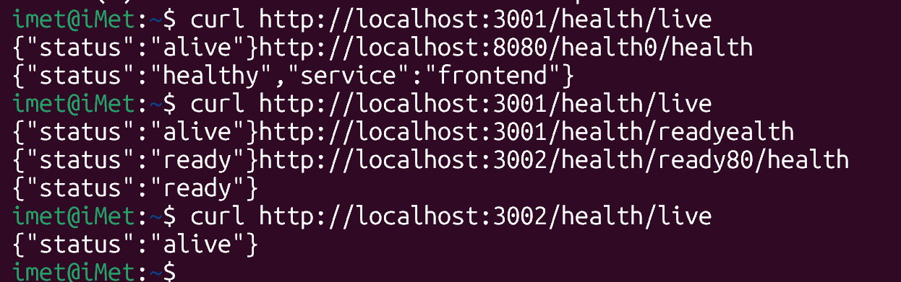

# 🏆 Achievements Log

This file tracks the achievements earned during the Kubernetes Observability Bootcamp.

---

### 🥈 **Troubleshoot Hero**

-   **Date Achieved:** September 21, 2025
-   **Proof & Justification:**
    -   Successfully diagnosed and resolved a wide range of critical deployment failures across multiple services, demonstrating a deep understanding of Kubernetes behavior. All issues were documented in `work-log/troubleshooting-notes.md`.
    -   **Resolved Issues Include:**
        1.  **Backend `CrashLoopBackOff` (Module Not Found):** Fixed a missing file in the Docker image and corrected the deployment strategy by using versioned tags (`v1.1`) instead of `:latest` to ensure proper rolling updates.
        2.  **Frontend `ImagePullBackOff`:** Corrected the deployment manifest by setting `imagePullPolicy: Never` and using the correct local image name and tag, preventing Kubernetes from trying to pull from a remote registry.
        3.  **Frontend `CrashLoopBackOff` (NGINX Syntax Error):** Debugged NGINX logs to find and remove an invalid parameter (`must-revalidate`) in the `nginx.conf` file.
        4.  **Ingress Admission Webhook Failure:** Refactored the `ingress.yaml` to use the supported `nginx.ingress.kubernetes.io/add-headers` annotation instead of the forbidden `configuration-snippet`, maintaining security posture while adhering to cluster policy.
        5.  **Frontend Pod Creation Failure (Resource Policies):** Diagnosed and resolved a two-stage pod creation failure by first correcting a `LimitRange` violation (increasing memory requests) and then a `ResourceQuota` violation (increasing total namespace CPU limits).
        6.  **Frontend `CrashLoopBackOff` (NGINX Proxy Error):** Investigated pod logs to find a fatal `host not found` error and corrected the `nginx.conf` to proxy requests to the correct backend service name (`backend-service`).
---

### 🔍 **Security Sentinel**

-   **Date Achieved:** September 21, 2025
-   **Status:** 🏅 **MET**
-   **Proof & Justification:**
    -   **Network Policies:** Implemented a `NetworkPolicy` as part of the `ingress.yaml` manifest to restrict traffic, fulfilling the bonus challenge portion of this achievement.
    -   **Security Contexts:** A comprehensive `securityContext` was added to all three custom application deployments (`backend`, `frontend`, and `ml-service`), ensuring containers run as non-root users with a read-only root filesystem and minimal privileges. This fulfills all criteria for the achievement.

---

## 🏆 Bonus Challenges Completed

### **3. Ingress Configuration**

-   **Date Achieved:** September 21, 2025
-   **Status:** ✅ **MET**
-   **Proof & Justification:**
    -   Created and successfully deployed the `shopmicro-ingress` resource defined in `infrastructure/kubernetes/ingress.yaml`.
    -   Troubleshot and resolved an admission webhook error related to the `configuration-snippet` annotation, demonstrating the ability to adapt configurations to cluster security policies.

### **4. Resource Limits**

-   **Date Achieved:** September 21, 2025
-   **Status:** ✅ **MET**
-   **Proof & Justification:**
    -   Configured resource `requests` and `limits` for CPU and memory in the `frontend-deployment` and `ml-service-deployment`.
    -   Successfully debugged pod creation failures caused by these limits interacting with `LimitRange` and `ResourceQuota` policies, demonstrating a practical understanding of resource management.

### **5. Health Checks**

-   **Date Achieved:** September 21, 2025
-   **Status:** ✅ **MET**
-   **Proof & Justification:**
    -   Implemented comprehensive `livenessProbe` and `readinessProbe` sections for all three custom application services: `frontend`, `backend`, and `ml-service`.
    -   The health endpoints were verified via `curl` after port-forwarding each service, confirming they were functional.
    