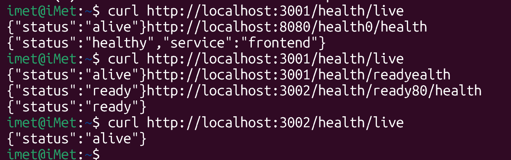

- **Task:** Initialized Minikube cluster and created the `shopmicro` namespace.
- **Commands:**
  - `minikube start --memory=6144 --cpus=4 --disk-size=20g`
  - `minikube addons enable ingress`
  - `minikube addons enable metrics-server`
  - `kubectl apply -f k8s/namespace.yaml`
- **Outcome:** Minikube is running with necessary addons, and the `shopmicro` namespace has been created and labeled.

- **Task:** Deployed PostgreSQL to the `shopmicro` namespace.
- **Commands:**
  - `kubectl apply -f k8s/deployments/postgres.yaml`
  - `kubectl get pods -n shopmicro -l app=postgres -w`
- **Outcome:** The PostgreSQL Deployment and Service were created. The pod is running and ready for connections within the cluster.

- **Task:** Deployed Redis cache to the `shopmicro` namespace.
- **Commands:**
  - `kubectl apply -f k8s/deployments/redis.yaml`
  - `kubectl get pods -n shopmicro -l app=redis -w`
- **Outcome:** The Redis Deployment and Service were created. The pod is running and available for caching within the cluster.

- **Task:** Built application Docker images and loaded them into Minikube.
- **Commands:**
  - `docker build -t shopmicro-backend:latest -f backend/Dockerfile ./backend`
  - `docker build -t shopmicro-frontend:latest -f frontend/Dockerfile ./frontend`
  - `docker build -t shopmicro-ml-service:latest -f ml-service/Dockerfile ./ml-service`
  - `minikube image load shopmicro-backend:latest`
  - `minikube image load shopmicro-frontend:latest`
  - `minikube image load shopmicro-ml-service:latest`
  - `minikube image ls | grep shopmicro`
- **Outcome:** The backend, frontend, and ml-service images are built and available within the Minikube cluster for deployment.

- **Task:** Deployed the backend service to the `shopmicro` namespace.
- **Commands:**
  - `kubectl apply -f k8s/deployments/backend.yaml`
  - `kubectl get pods -n shopmicro -l app=backend -w`
  - `kubectl port-forward -n shopmicro svc/backend 3001:3001`
- **Outcome:** The backend Deployment and Service are running. The two pods are healthy and responding to health checks.

- **Task:** Deployed the frontend service to the `shopmicro` namespace.
- **Notes:** This deployment required significant troubleshooting, including fixing an `ImagePullBackOff` error by setting the correct image tag and `imagePullPolicy`, and resolving a `CrashLoopBackOff` caused by an Nginx configuration syntax error. The full details are documented in `work-log/troubleshooting-notes.md`.
- **Commands:**
  - `kubectl apply -f infrastructure/kubernetes/frontend.yaml`
  - `kubectl get pods -n shopmicro -w`
- **Outcome:** The frontend Deployment and Service are running. The pods are healthy and the UI is accessible within the cluster.

- **Task:** Verified health and connectivity of core application services.
- **Notes:** Used `kubectl port-forward` for both the `backend` and `frontend-service`. Both services responded successfully to health checks via `curl`, confirming they are running and accessible.
- **Commands:**
  - `curl http://localhost:3001/health`
  - `curl http://localhost:8080/health`
- **Outcome:** The backend and frontend are confirmed to be operational, completing the initial application deployment phase.

- **Task:** Re-deployed all services using the production-grade manifests from `infrastructure/kubernetes/`.
- **Notes:** This involved a full teardown of the `shopmicro` namespace and a sequential re-creation of all resources, including the namespace, configmap, secrets, storage, application deployments, and ingress. This establishes a more robust and scalable foundation for the application.
- **Commands:**
  - `kubectl delete namespace shopmicro`
  - `kubectl apply -f infrastructure/kubernetes/namespace.yaml`
  - `kubectl apply -f infrastructure/kubernetes/configmap.yaml`
  - `kubectl apply -f infrastructure/kubernetes/postgres.yaml`
  - `kubectl apply -f infrastructure/kubernetes/redis.yaml`
  - `kubectl apply -f infrastructure/kubernetes/backend.yaml`
  - `kubectl apply -f infrastructure/kubernetes/frontend.yaml`
  - `kubectl apply -f infrastructure/kubernetes/ml-service.yaml`
  - `kubectl apply -f infrastructure/kubernetes/ingress.yaml`
- **Outcome:** All application services and their dependencies are now running successfully using the complete, production-ready manifests.

- **Task:** Successfully deployed the `frontend` service.
- **Notes:** The deployment was initially blocked by namespace resource constraints. This required a multi-step troubleshooting process involving fixing pod resource requests to satisfy the `LimitRange` and then increasing the total namespace `ResourceQuota`. Full details are in the troubleshooting log.
- **Commands:**
  - `kubectl describe replicaset -n shopmicro <replicaset-name>`
  - `kubectl apply -f infrastructure/kubernetes/frontend.yaml`
  - `kubectl apply -f infrastructure/kubernetes/namespace.yaml`
  - `kubectl rollout restart deployment/frontend-deployment -n shopmicro`
- **Outcome:** The `frontend-deployment` is now fully running with 2/2 replicas available, resolving all deployment issues.

- **Task:** Verified health of all application services and resolved the final `frontend` deployment failure.
- **Notes:** After fixing the namespace resource constraints, the `frontend` pods were still crashing. Investigation of the pod logs revealed an NGINX configuration error where it was trying to proxy to an incorrect backend service name. Corrected the `nginx.conf`, built and deployed a new image (`v1.2`), which resolved the issue.
- **Commands:**
  - `kubectl port-forward -n shopmicro svc/<service-name> <local-port>:<cluster-port>`
  - `curl -v http://localhost:<port>/health`
  - `kubectl logs -n shopmicro <pod-name>`
- **Outcome:** All application services (`frontend`, `backend`, `ml-service`) are now confirmed healthy and running in the cluster. The application is fully deployed and ready for the next stage of the bootcamp.

- **Task:** Deployed the Mimir service for long-term metrics storage.
- **Notes:** The deployment was a multi-stage process. Initially, the architecture was corrected to a monolithic model as per the lab guide. Subsequently, resolved a cascade of pod scheduling failures by increasing the `LimitRange` and `ResourceQuota` in `namespace.yaml`. Finally, fixed a `CrashLoopBackOff` by removing an invalid `auth_enabled` field from the Mimir `ConfigMap`.
- **Commands:**
  - `kubectl delete deployment,service,configmap -n shopmicro -l app.kubernetes.io/name=mimir` (Cleanup of old attempt)
  - `kubectl apply -f infrastructure/kubernetes/namespace.yaml`
  - `kubectl apply -f infrastructure/kubernetes/mimir.yaml`
  - `kubectl rollout restart deployment/mimir-deployment -n shopmicro`
- **Outcome:** The Mimir service is now successfully deployed and running in a stable, monolithic configuration, ready for metrics collection.